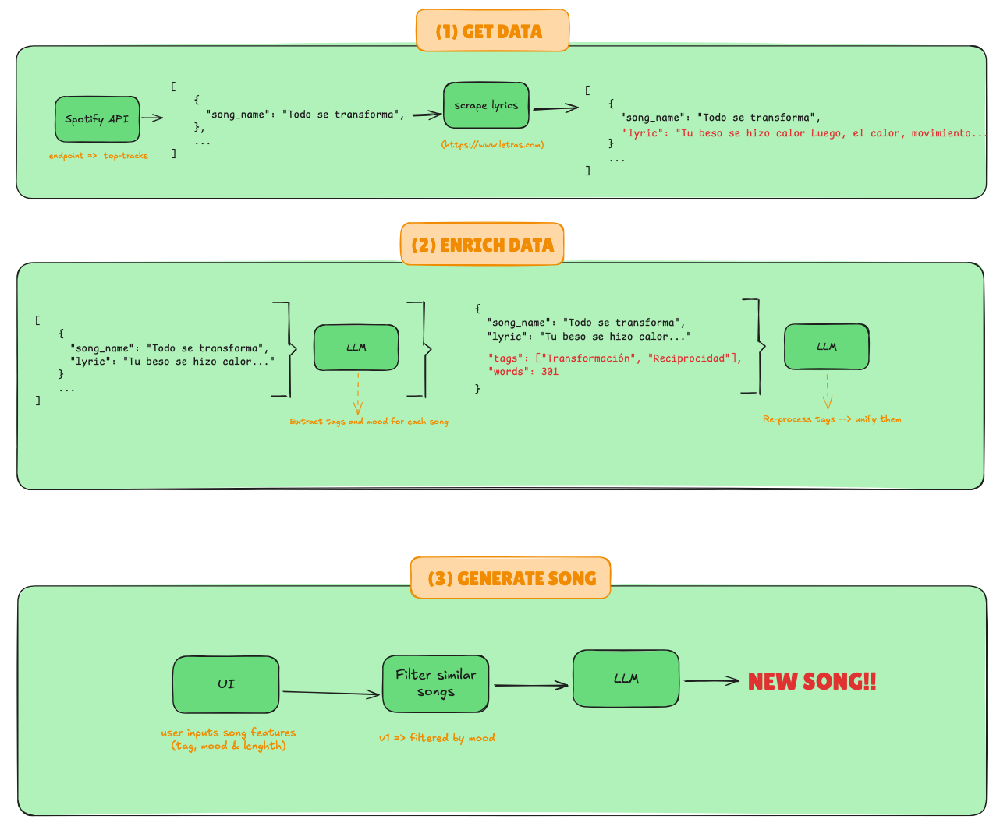

# 🎵 Spotify Song Generator

This project is an educational experiment that explores the use of large language models (LLMs) to generate new songs based on existing lyrics. The pipeline processes real songs, enriches them with thematic and emotional metadata, and generates new lyrics with the help of an LLM.

---

## 🧭 Pipeline Overview

### 1. Data Extraction
- Uses Spotify's **artist's top tracks API** to retrieve song titles.
- Then scrapes lyrics from `letras.com` using those titles.
- **Audio features are not used** due to API deprecation.
- The current version works with 10 songs from **Jorge Drexler**.

### 2. Enriching with LLM
Each song is processed to extract:
- Thematic tags (e.g., `"Love"`, `"Transformation"`)
- Mood classification (e.g., `"romantic"`)
- Structural metrics (lines, paragraphs)

### 3. Song Generation
- The user defines desired attributes.
- The system selects similar songs.
- A new song is generated using the LLM.

---

## 📁 Project Structure

- `01-get_connection.py`: handles secrets (excluded from Git)
- `02-process_songs.py`: scrapes and prepares raw lyrics
- `03-main.py`: UI built with [Streamlit](https://streamlit.io/) for interactive generation
    - It currently allows the user to input desired song features (tag, mood, and length) and generates a new song based on similar ones.
- `llm_helper.py`: prompt engineering and LLM helpers
- `song_generator.py`: generates the new lyrics
- `few_shot.py`: few-shot examples for prompting
- `raw_songs.json`: input lyrics
- `processed_songs.json`: enriched song data

---

## 🚧 Current Limitations

- Only supports one fixed artist.
- No audio features are used due to deprecated Spotify API.

---

## 📌 Roadmap

- [ ] Allow user to choose artist (from 10 preselected ones).
- [ ] Let the user define how many songs to process.
- [ ] Add semantic similarity filtering (clustering, vector DBs).

---

## 🛑 Legal Notice

- This is a **non-commercial** educational project.
- All rights for the lyrics belong to their **authors and publishers**.
- Lyrics and data were obtained from `letras.com` and `Spotify`.
- No redistribution or commercial use of derived works is intended.

---

## 🧠 Inspired by

- Creative potential of LLMs
- Intersection of music and generative AI
- Personalized content generation projects

---